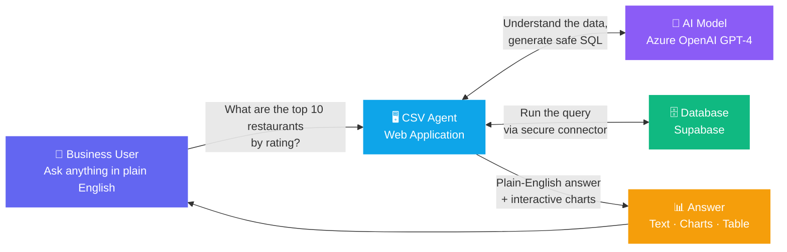
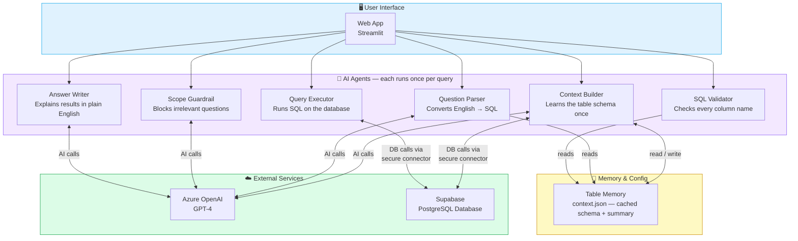
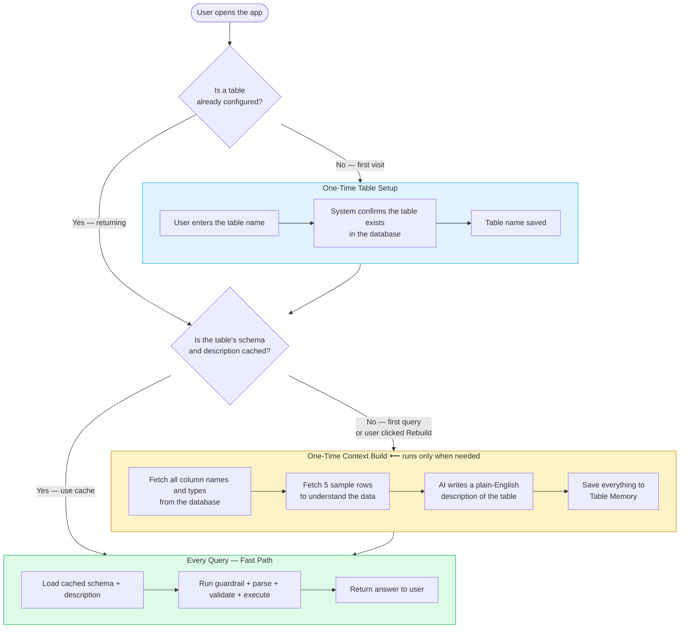
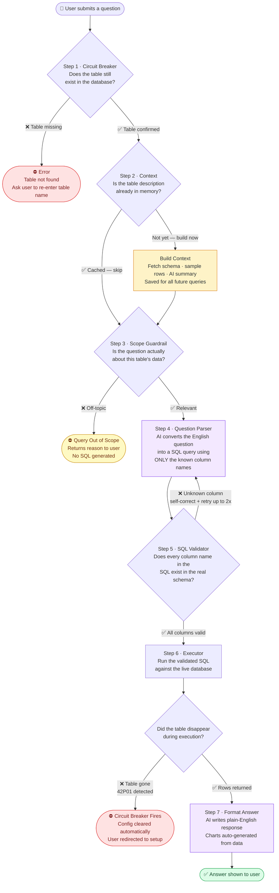
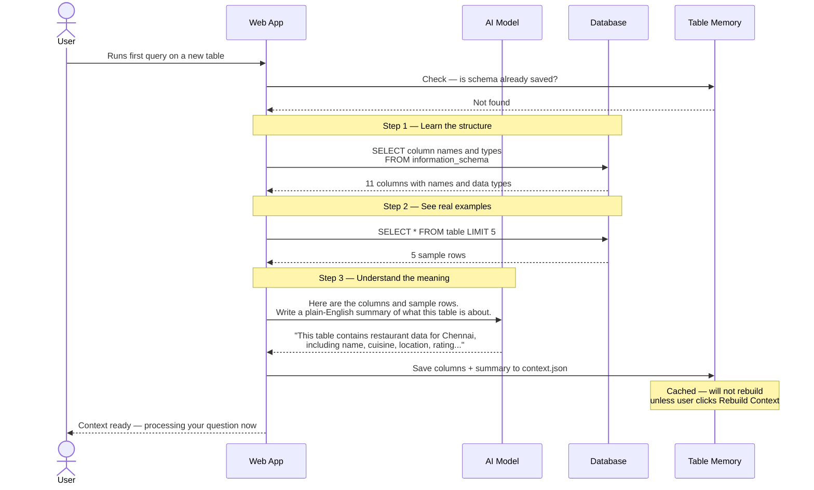
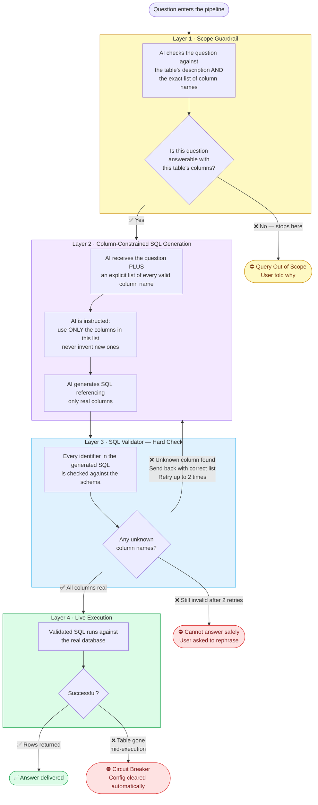
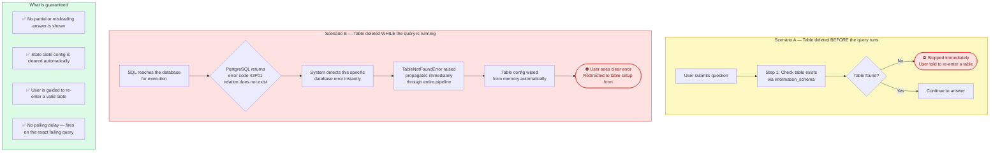
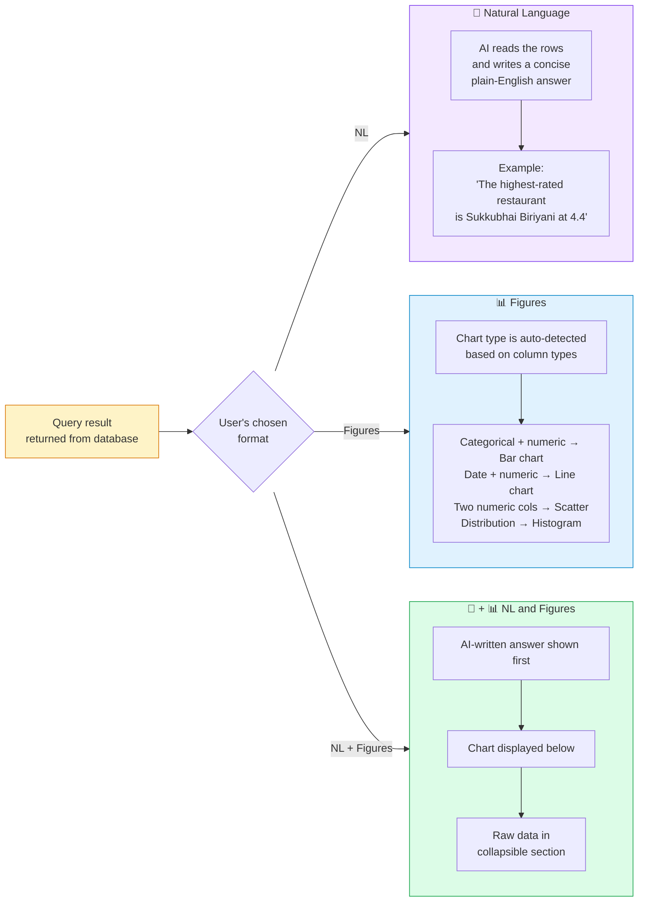
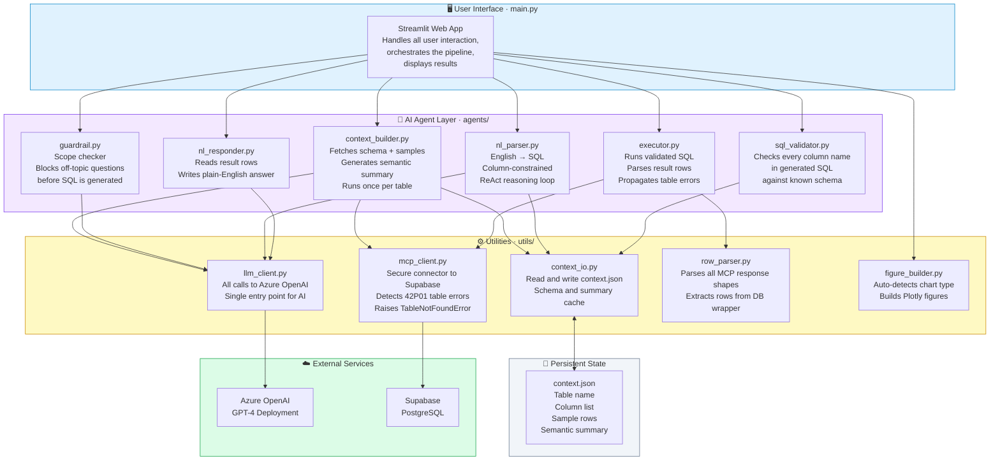

# CSV Agent — How It Works
### Architecture & Flow Diagrams
> Prepared for Executive Presentation · Techno-Functional Audience

---

## Contents

1. [What Is CSV Agent?](#1-what-is-csv-agent)
2. [System Components at a Glance](#2-system-components-at-a-glance)
3. [First-Time Setup vs Every-Day Use](#3-first-time-setup-vs-every-day-use)
4. [Full Query Pipeline — Step by Step](#4-full-query-pipeline--step-by-step)
5. [How the System Learns Your Table Once](#5-how-the-system-learns-your-table-once)
6. [Four Layers of Protection Against Bad Answers](#6-four-layers-of-protection-against-bad-answers)
7. [Circuit Breaker — What Happens if the Table Is Deleted](#7-circuit-breaker--what-happens-if-the-table-is-deleted)
8. [Three Ways to See Your Answer](#8-three-ways-to-see-your-answer)
9. [Component Map — What Each Part Does](#9-component-map--what-each-part-does)

---

## 1. What Is CSV Agent?

CSV Agent lets a business user ask questions about their data **in plain English** — no SQL knowledge needed. It connects to a database table (originally uploaded from a CSV), understands the structure of the data automatically, and returns answers as readable text, charts, or both.

---

## 2. System Components at a Glance

Six specialised modules each own a single responsibility. No module does more than one job.

---

## 3. First-Time Setup vs Every-Day Use

The system does heavy learning **only once per table**. Every subsequent query skips straight to answering.

---

## 4. Full Query Pipeline — Step by Step

Every question travels through five sequential checkpoints. Any checkpoint can stop the pipeline early with a clear reason.

---

## 5. How the System Learns Your Table Once

The Context Build is the system's "reading session" on your data. It happens once, saves everything, and is reused on every query until you explicitly ask for a rebuild.

---

## 6. Four Layers of Protection Against Bad Answers

The system cannot hallucinate column names or answer off-topic questions. Four independent checkpoints enforce this.

---

## 7. Circuit Breaker — What Happens if the Table Is Deleted

If a database table is deleted at any point — before, during, or after a query — the system detects it instantly and brings everything to a clean stop. No stale data is served. No silent failures.

---

## 8. Three Ways to See Your Answer

After a query executes, the user chooses how they want the result presented. All three modes show the raw data table in a collapsible section below.

---

## 9. Component Map — What Each Part Does

Every file in the project has exactly one responsibility. Arrows show which components call which.

---

## Summary — Key Design Decisions

| Decision | Why |
|---|---|
| **Context built once, cached forever** | Avoids repeated schema lookups on every query. Rebuild is user-controlled. |
| **Guardrail checks column list, not just topic** | Stops questions about data that doesn't exist before any SQL is generated. |
| **SQL validator is a hard rule-based check** | Not probabilistic — every column name is checked against a known list. AI cannot bypass it. |
| **TableNotFoundError propagates uncaught** | The pipeline crashes instantly and cleanly on mid-query table deletion. No partial answers. |
| **Three response modes** | Accommodates different audiences: executives want NL, analysts want charts, engineers want raw data. |
| **All DB access via MCP connector** | Single entry point for all database calls. Error detection (42P01) is centralised in one place. |

---

_CSV Agent · Internal Architecture Documentation_
