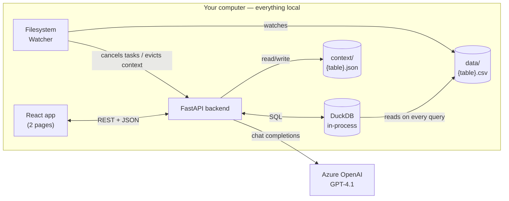
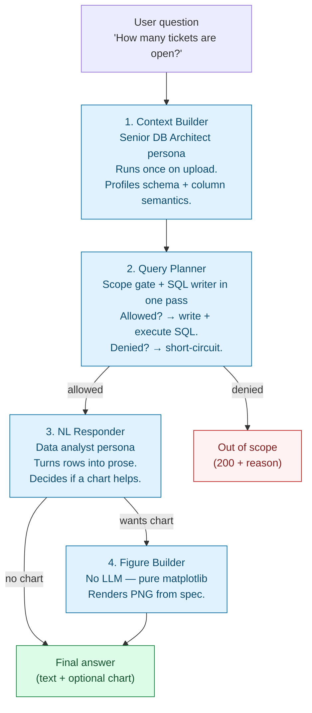
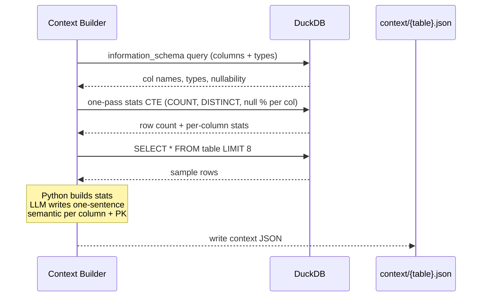
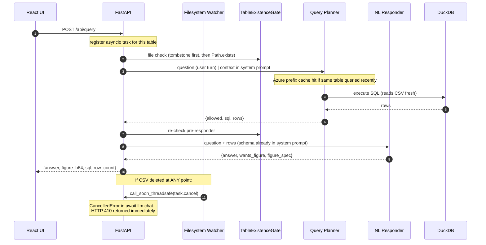
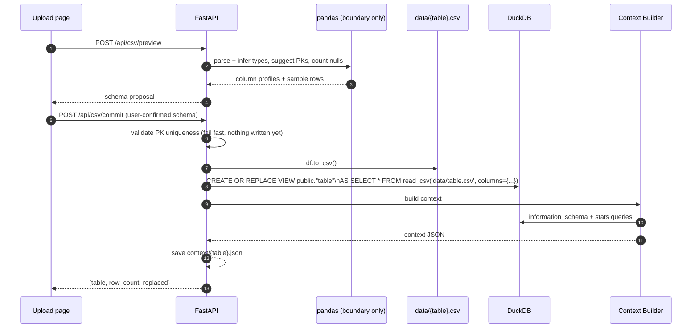

# IGNA Query Agent

> Ask plain-English questions of any CSV you upload. The system figures out the schema, the SQL, and the chart — without ever being told what your data is about.

A desktop-only natural-language interface over a CSV you upload. A 4-agent FastAPI pipeline (Context Builder → Query Planner → NL Responder → optional Figure Builder) queries an **in-process DuckDB** instance so the agents stay data-agnostic: no schema is hard-coded, no row values are ever inlined into prompts beyond a 5-row sample.

```
.
├── backend/    # FastAPI + Azure OpenAI GPT-4.1 + DuckDB (in-process)
├── frontend/   # Vite + React + TS + Tailwind, 2 pages
├── context/    # ./context/{table}.json  — per-table profiles, written by Context Builder
└── data/       # ./data/{table}.csv      — uploaded CSVs (source of truth for all queries)
```

---

## The 60-second pitch

Imagine handing someone a spreadsheet and saying *"tell me what's interesting in here."* Most chatbots can't do this — they need someone to first write code that explains every column, every relationship, every quirk of your data. The moment your spreadsheet changes, the code breaks.

**IGNA does the explaining itself.**

You drop in any CSV. The system:

1. **Saves it locally and registers it as a queryable SQL table.**
2. **Profiles the table from scratch** — a senior-DBA-style AI agent looks at the columns, samples a handful of values, and writes its own description of what each column *means*.
3. **Lets you ask questions in plain English.** "How many tickets are still open?" "Compare resolution times by team." "Top 10 rows by rating."
4. **Generates the SQL, runs it, and answers** — with a chart when it makes sense.

Completely data-agnostic: it knows nothing about your data until you upload it.

---

## Architecture



Everything runs on your machine. The only outbound network call is to Azure OpenAI.

- **DuckDB (in-process)** — embedded analytical database. CSVs in `data/` are registered as SQL views; every `execute_sql` call reads the CSV file fresh. No separate process, no network, no catalog file on disk.
- **Filesystem Watcher (watchdog)** — monitors `data/` in a background thread. CSV deleted → drops the DuckDB view, evicts context, tombstones the table, and cancels any in-flight LLM tasks immediately via `asyncio.Task.cancel()`.
- **Azure OpenAI (GPT-4.1)** — powers all four agents.

---

## The four agents



| # | Agent | Job | LLM style |
|---|---|---|---|
| 1 | Context Builder | Profile columns: type, cardinality, null rate, one-sentence semantic per column, PK guess | single-shot JSON (stats built in Python; LLM writes semantics only) |
| 2 | Query Planner | Scope gate + SQL writer in one pass; self-corrects on DuckDB errors (`MAX_SQL_RETRIES`) | single-shot JSON + Python retry |
| 3 | NL Responder | Turn result rows into prose; decide if a chart is warranted | single-shot JSON |
| 4 | Figure Builder | Render matplotlib PNG from chart spec | no LLM |

**Why one agent for scope + SQL?**
The old two-agent design (NL Parser → SQL Agent) made two sequential LLM round-trips. Query Planner does both in one call — same safety, ~500 ms less per query.

**Context is pinned to the system prompt** so Azure's prefix-caching reuses it across consecutive queries to the same table. Only the user turn (the question) changes.

---

## Context file — how the system learns your data

When you upload a CSV the **Context Builder** runs once and writes `context/{table}.json`.



**Context lifecycle:**

| Event | Action |
|---|---|
| CSV data edited (same columns) | No-op — DuckDB reads the file fresh on every query |
| CSV schema changed (columns added/removed/renamed) | Watcher detects header diff → context evicted → rebuilt on next query |
| CSV deleted | Watcher drops view + evicts context + tombstones + cancels in-flight tasks |
| CSV re-uploaded | Tombstone cleared, view re-registered, context rebuilt |

---

## Query flow



---

## Circuit breakers

| Trigger | HTTP | Mechanism |
|---|---|---|
| **Table deleted** | **410** | Event-driven. Watcher fires on file deletion, tombstones the table, and cancels the asyncio task via `call_soon_threadsafe`. In-flight LLM calls abort in <5 ms, not after the response returns. Gate also checks tombstone at every agent boundary. |
| **Out of scope** | 200 `out_of_scope` | Query Planner sets `allowed=false`. |
| **DB error** | 502 `db_error` | DuckDB raised an exception (malformed SQL, view missing). |
| **Agent loop exhausted** | 500 `agent_failure` | ReAct iteration cap hit without a final answer. |

---

## CSV upload flow



Key choices:
- **No DDL, no INSERT batches.** CSV is written to `data/` and registered as a DuckDB VIEW. A 500k-row file commits in under 200 ms.
- **Re-upload replaces entirely.** Same table name → evict old context, overwrite CSV, re-register view, rebuild context.
- **PK validated before writing.** Duplicates or nulls in chosen PK columns → 400 before anything touches disk.
- **Pandas is boundary-only.** All reads after upload go through DuckDB. Agents never see a DataFrame.

---

## LLM caching

The only caching is **Azure OpenAI's transparent prefix caching**.

Table context (schema + semantics) is part of the **system prompt**, not the user message. The system prompt is identical for all queries to the same table, so consecutive calls within Azure's cache window get the prompt-processing portion served from cache. No application-level result cache exists.

---

## Prerequisites

- Python 3.11+
- Node 18+ (frontend only — backend has no Node dependency)
- Azure OpenAI deployment of **GPT-4.1**

## Setup

```powershell
# Backend
cd backend
python -m venv venv
.\venv\Scripts\Activate.ps1
pip install -e .
copy .env.example .env   # set AZURE_OPENAI_ENDPOINT, AZURE_OPENAI_API_KEY, AZURE_OPENAI_DEPLOYMENT

# Frontend
cd ..\frontend
npm install
```

## Run

```powershell
# Terminal 1
cd backend
.\venv\Scripts\Activate.ps1
uvicorn app.main:app --reload --port 8000

# Terminal 2
cd frontend
npm run dev
```

Open http://localhost:5173.

---

## Smoke test

1. Backend logs `opening DuckDB (in-memory)` and `data watcher started`.
2. Upload a CSV — confirm `data/{table}.csv` exists and `context/{table}.json` has semantic descriptions.
3. Ask a question — expect prose + optional chart.
4. Ask an out-of-scope question — expect 200 `out_of_scope`.
5. **While a query is running**, delete `data/{table}.csv` from Explorer — expect HTTP 410 `table_deleted` with `phase: mid_llm_call` within milliseconds.
6. Re-upload the same CSV — queries resume.
7. Edit a cell value in the CSV and save — next query reflects the change (no restart).
8. Rename a column header and save — backend logs `schema drift detected → context evicted`; next query rebuilds context.

---

<!-- ## Configuration (`.env`)

| Var | Default | Purpose |
|---|---|---|
| `AZURE_OPENAI_ENDPOINT` | — | Azure OpenAI resource endpoint |
| `AZURE_OPENAI_API_KEY` | — | API key |
| `AZURE_OPENAI_API_VERSION` | `2024-10-21` | API version |
| `AZURE_OPENAI_DEPLOYMENT` | `gpt-4.1` | Deployment name |
| `CONTEXT_DIR` | `../context` | Per-table JSON profiles |
| `DATA_DIR` | `../data` | Uploaded CSVs + DuckDB views point here |
| `MAX_REACT_ITERATIONS` | 8 | Hard cap on tool calls per agent run |
| `MAX_SQL_RETRIES` | 2 | Query Planner self-correction budget |
| `LOG_LEVEL` | `INFO` | `DEBUG` adds raw LLM payloads + full SQL | -->

---

## Backend log reference

| Logger | Covers |
|---|---|
| `igna.http` | Every HTTP request — method, path, status, duration |
| `igna.db` | Every DuckDB call — SQL, elapsed ms, row count, errors |
| `igna.watcher` | Filesystem events — deleted / modified / created, tasks cancelled |
| `igna.gate` | Every TableExistenceGate check (`gate ok` / `gate TRIPPED`) |
| `igna.context` | Save / load / evict of `context/{table}.json` |
| `igna.csv` | Preview parse, PK validation, commit progress |
| `igna.query` | Per-phase markers + query start/end |
| `igna.agent.<name>` | Entry args + exit summary per agent |
| `igna.llm` | LLM round-trip — latency, token counts, result |

---

## Database tools and implementation locations

The LLM does not call Supabase MCP tools directly. The Query Planner generates
PostgreSQL as structured JSON. The backend then executes reads immediately or
holds writes until explicit user confirmation.

| Tool / component | Used for | Exact location |
|---|---|---|
| Query Planner LLM | Classifies read/write intent and generates PostgreSQL, a summary, and affected-table metadata. It does not execute SQL. | [`backend/app/agents/query_planner.py`](backend/app/agents/query_planner.py) |
| Query Planner prompt | Defines the planner JSON contract and PostgreSQL read/write rules. | [`backend/app/prompts/query_planner.md`](backend/app/prompts/query_planner.md) |
| Supabase MCP `execute_sql` | Executes all LLM-generated reads and explicitly confirmed DML/DDL writes. | [`backend/app/db_client.py`](backend/app/db_client.py) |
| Supabase MCP `list_tables` | Lists tables in the Supabase `public` schema for the frontend selector. | [`backend/app/db_client.py`](backend/app/db_client.py) |
| Supabase MCP `apply_migration` | Available for migration-style SQL, but currently unused by the active pipeline. | [`backend/app/db_client.py`](backend/app/db_client.py) |
| MCP response normalizer | Converts Supabase response envelopes and untrusted-data wrappers into row dictionaries. | [`backend/app/db_client.py`](backend/app/db_client.py) |
| Query orchestrator | Loads context, invokes the planner, executes reads, creates write previews, and handles confirm/cancel requests. | [`backend/app/routers/query.py`](backend/app/routers/query.py) |
| Pending write store | Stores the exact server-side SQL awaiting confirmation and makes confirmation IDs single-use. | [`backend/app/pending_writes.py`](backend/app/pending_writes.py) |
| SQL classifier | Independently classifies DML, DDL, and ambiguous SQL as mutating so confirmation cannot be bypassed. | [`backend/app/sql_safety.py`](backend/app/sql_safety.py) |
| Generic ReAct `execute_sql` tool | Read-only agent tool retained in shared scaffolding. It is not passed to the active single-shot Query Planner. | [`backend/app/agents/base.py`](backend/app/agents/base.py) |
| Generic ReAct `list_tables` tool | Table-listing agent tool retained in shared scaffolding. It is not used by the active Query Planner. | [`backend/app/agents/base.py`](backend/app/agents/base.py) |
| Direct PostgreSQL `psycopg` upload | Transactionally drops/recreates a table and bulk-loads validated CSV rows using PostgreSQL `COPY`. CSV ingestion intentionally does not use MCP. | [`backend/app/supabase_upload.py`](backend/app/supabase_upload.py) |
| CSV upload router | Handles preview, null fills, PK checks, upload invocation, and post-upload context rebuilding. | [`backend/app/routers/csv.py`](backend/app/routers/csv.py) |
| Context Builder | Uses MCP `execute_sql` for schema inspection, samples, row counts, distinct counts, and null percentages. | [`backend/app/agents/context_builder.py`](backend/app/agents/context_builder.py) |
| Local context store | Saves and loads table-specific context at `context/{table}.json`. | [`backend/app/context_store.py`](backend/app/context_store.py) |
| Frontend API client | Calls query, confirm, and cancel endpoints. | [`frontend/src/api.ts`](frontend/src/api.ts) |
| Frontend confirmation UI | Displays the write summary and SQL and provides Confirm and Cancel controls. | [`frontend/src/pages/QueryPage.tsx`](frontend/src/pages/QueryPage.tsx) |

### Active operation paths

- **Read:** Query Planner → SQL classifier → Supabase MCP `execute_sql`
  → NL Responder → optional Figure Builder.
- **Write:** Query Planner → SQL classifier → pending write store →
  frontend confirmation → Supabase MCP `execute_sql` → context rebuild.
- **CSV upload:** CSV router → pandas validation/type coercion → direct
  `psycopg` transaction and `COPY` → Context Builder through Supabase MCP.

---

## What is intentionally not in scope

- No auth / login.
- No multi-table joins — one CSV, one table, one context.
- No data cleaning beyond null-fills.
- No deployment — desktop only.
- No conversation memory — each question is independent.


# Tradeoffs
1. Long conversations increase the query TAT.
