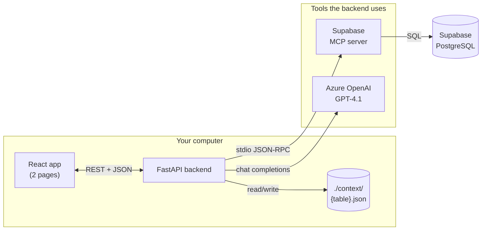
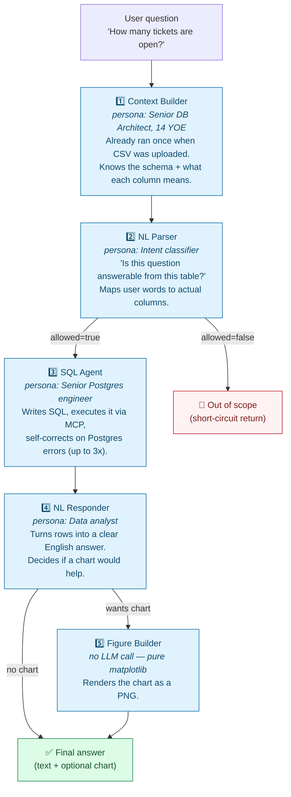
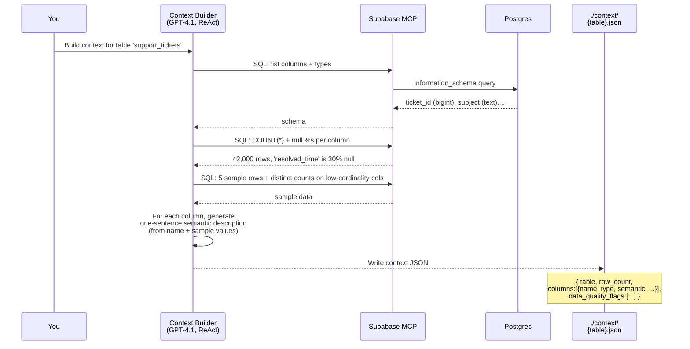
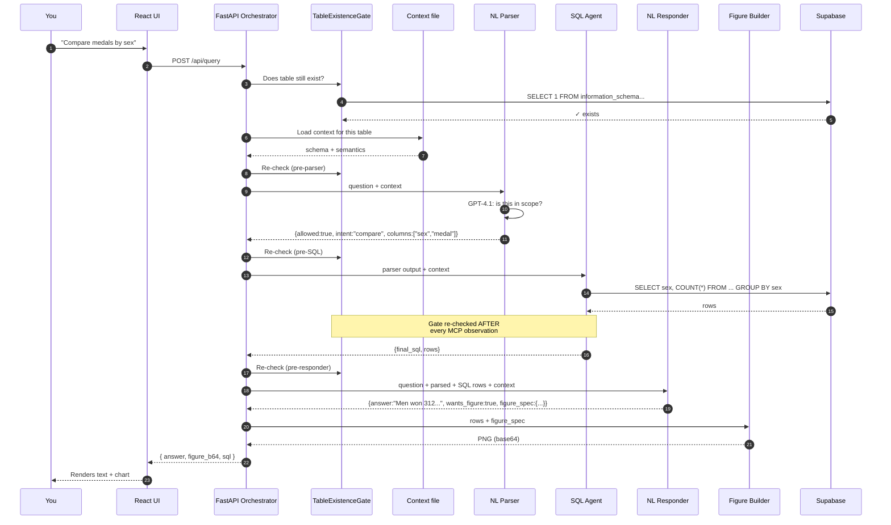
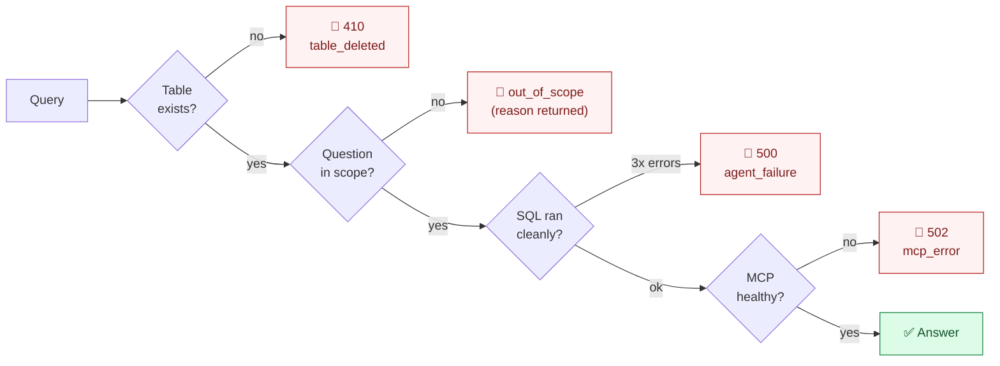
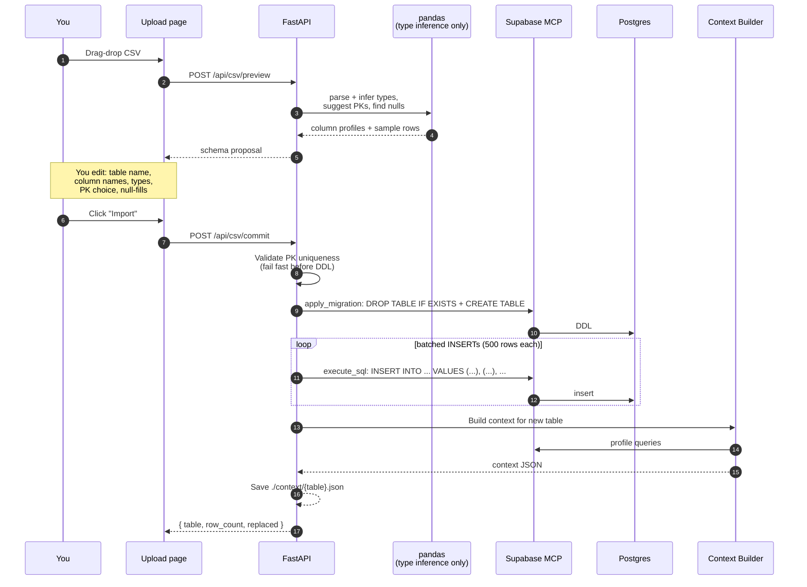
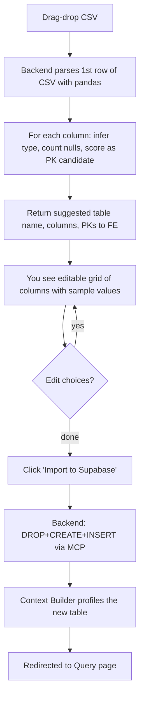

# IGNA Query Agent

> Ask plain-English questions of any CSV you upload. The system figures out the database, the SQL, and the chart — without ever being told what your data is about.

A desktop-only natural-language interface over a Supabase table you upload as CSV. A 5-agent FastAPI pipeline (Context Builder → NL Parser → SQL Agent → NL Responder → optional Figure Builder) talks to Supabase exclusively via the **Supabase MCP server**, so the agents stay data-agnostic: no schema is hard-coded, no row values are ever inlined into prompts beyond a 5-row sample.

```
.
├── backend/    # FastAPI + Azure OpenAI GPT-4.1 + Supabase MCP
├── frontend/   # Vite + React + TS + Tailwind, 2 pages
└── context/    # ./context/{table}.json  — per-table profiles, written by Context Builder
```

---

## 🎬 The 60-second pitch (for a non-technical audience)

Imagine handing someone a spreadsheet and saying *"tell me what's interesting in here."* Most chatbots can't do this — they need someone to first write code that explains every column, every relationship, every quirk of your data. The moment your spreadsheet changes, the code breaks.

**IGNA does the explaining itself.**

You drop in any CSV. The system:

1. **Imports it into a real database** (Supabase / PostgreSQL).
2. **Profiles the table from scratch** — a senior-DBA-style AI agent looks at the columns, samples a handful of values, and writes its own description of what each column *means*.
3. **Lets you ask questions in plain English.** "How many tickets are still open?" "Compare resolution times by team." "Top 10 rows by rating."
4. **Generates the SQL, runs it, and answers** — with a chart when it makes sense.

It is **completely data-agnostic** — it knows nothing about your data until you upload it, and it learns from the data itself, not from anyone telling it what to expect.

---

## 🏗️ How the pieces fit together



Three external things:

- **Supabase** — a hosted PostgreSQL database. Your CSV becomes a real table here.
- **Supabase MCP server** — a small process the backend spawns at startup. It speaks "MCP" (a protocol for AI agents to call tools) on one side and PostgreSQL on the other. **Every** database read or write happens through this server. The agents never get a direct database connection.
- **Azure OpenAI (GPT-4.1)** — the language model that powers all five agents.

---

## 🧠 The five agents — what each one does, and why

> Think of this as a small team of specialists, each with one job. They pass notes between themselves. If any specialist can't do their job, the line stops — no fake answers.



| # | Agent | Persona | Has tools? | LLM call style |
|---|---|---|---|---|
| 1 | Context Builder | senior DB architect, 14 YOE | `execute_sql`, `list_tables` | **ReAct** (think → SQL → observe → repeat) |
| 2 | NL Parser | intent + scope gate | none | single-shot JSON |
| 3 | SQL Agent | senior Postgres engineer | `execute_sql` | **ReAct** + self-correct on errors |
| 4 | NL Responder | data analyst | none | single-shot JSON |
| 5 | Figure Builder | matplotlib renderer | none | **no LLM** — pure Python |

### Why split it up?

A single mega-prompt that tries to do everything tends to hallucinate columns, invent SQL syntax, and ignore safety rules. Splitting it forces a clean handoff at every boundary:

- The NL Parser **cannot write SQL** even if asked — its only output is a structured "allowed / not allowed + which columns".
- The SQL Agent **cannot decide to refuse a query** — by the time it runs, scope is already approved.
- The NL Responder **cannot fabricate rows** — it can only describe what the SQL Agent actually returned.

Each agent's prompt is in `backend/app/prompts/*.md` — a persona statement, a step-by-step procedure, a strict JSON output schema, and a few-shot example.

---

## 🗂️ How the system "learns" your data — the Context file

When you upload a CSV, the **Context Builder** (Agent 1) runs once and writes `./context/{table_name}.json`. That file is everything the rest of the system "knows" about your table.



A trimmed example of what ends up on disk:

```json
{
  "table": "support_tickets",
  "row_count": 42189,
  "columns": [
    {
      "name": "ticket_id",
      "type": "bigint",
      "nullable": false,
      "null_pct": 0.0,
      "distinct": 42189,
      "semantic": "Unique identifier for each support ticket — sequential integer; likely primary key."
    },
    {
      "name": "resolution_time_in_hrs",
      "type": "double precision",
      "nullable": true,
      "null_pct": 31.2,
      "semantic": "Hours elapsed between a ticket being opened and resolved. Null when the ticket is still open."
    }
  ],
  "data_quality_flags": [
    {"column": "resolution_time_in_hrs", "issue": "high_nulls", "detail": "31% null — open tickets have no resolution time yet."}
  ]
}
```

The **only place sample row values ever touch the LLM** is in Step 3 of Context Building (5 rows × N columns). After that, every downstream agent sees the schema + semantic descriptions, **never raw row values**. This is what makes the system safe to use on sensitive data.

---

## 🔁 What happens when you ask a question



**Notice the gate.** Before every agent, and after every database touch *inside* an agent, the system asks Postgres: "does this table still exist?" If someone drops the table mid-query, the next gate fires and the request aborts with HTTP 410. The user immediately sees `🚫 Table 'X' was deleted` — no half-finished answers based on stale data.

---

## 🛡️ Circuit breakers (safety stops)



| Trigger | HTTP code | When |
|---|---|---|
| **Table deleted / missing** | **410** | Re-checked at every agent boundary AND after every MCP observation inside ReAct loops. Hard, instantaneous. |
| **Out of scope** | 200 with `status:"out_of_scope"` | NL Parser sets `allowed=false` — e.g. "what's the weather?" against a tickets table. |
| **MCP error** | 502 | Supabase rejected a tool call (auth, network, malformed SQL). |
| **Agent loop exhausted** | 500 | ReAct iteration cap (default 8) hit without a final answer. |

The table-existence gate is the strictest of the four. The user can drop the table from Supabase Studio while a query is mid-flight, and the system will catch it within ~1 second — *not* return a SQL error, *not* return a cached answer.

---

## 📥 CSV upload flow



Key choices:

- **DROP + CREATE every time.** Re-uploading the same table replaces it entirely — so you can fix a bad PK choice or column type without manual cleanup.
- **PK uniqueness is validated up front.** If you pick `email` as the PK but the CSV has duplicates, the import fails before any DDL runs (no orphan empty tables left behind).
- **Null-fill is the only data cleaning offered.** Per the project brief — no row drops, no type recasting. Anything more invasive should happen in your source spreadsheet, not in here.
- **Pandas is allowed *only* at this boundary.** Once data is in Supabase, every read goes through MCP. The agents never see a pandas DataFrame.

---

## 🎨 What you see vs. what's happening

### The Upload page



### The Query page (always-on context badge)

While you chat, a green status bar at the top of the Query page shows that the active table has a fresh context — number of columns, number of rows, the primary key, when the context was built, and any data-quality flags. Click **show details** to see the full column-by-column semantic description.

If the table has *no* cached context yet (e.g. you just uploaded), the bar is amber: *"No cached context — the first query will build it (~10-20s)."*

If you switch tables in the dropdown, the chat history clears and the badge re-reads from disk.

---

## 🛠️ Why this stack

| Choice | Why |
|---|---|
| **Supabase MCP server** (not psycopg directly) | Forces a clean tool-use boundary. The agents only ever call named tools (`execute_sql`, `apply_migration`, `list_tables`) — no SQL injection surface, no schema-binding code. Swapping to a different MCP-speaking database would touch zero agent code. |
| **Azure OpenAI GPT-4.1** | Strong tool-use + JSON-mode performance. ReAct loops need a model that reliably emits tool calls; GPT-4.1 does. |
| **Local JSON for context** | Desktop-only project — a file is simpler than a cache server, inspectable in any text editor, and instantly portable. |
| **No own ETL pipeline** | Per the project brief: Supabase already has a battle-tested CSV-to-table path. We feed it through MCP rather than re-implementing it. Pandas only does *type inference*, not actual data movement at scale. |
| **5 agents, not 1** | Lets each prompt stay short and specialized. Limits blast radius if the LLM goes off-script. Makes the system debuggable — each agent's input and output is logged separately. |

---

## Prerequisites

- Python 3.11+
- Node 18+ (for the Vite dev server **and** for `npx @supabase/mcp-server-supabase` which the backend spawns over stdio)
- A Supabase project + Personal Access Token (https://supabase.com/dashboard/account/tokens)
- An Azure OpenAI deployment of **GPT-4.1**

## Setup

```powershell
# Backend
cd backend
python -m venv .venv
.\.venv\Scripts\Activate.ps1
pip install -e .
copy .env.example .env   # then edit .env with your tokens

# Frontend
cd ..\frontend
npm install
```

## Run (two terminals)

```powershell
# Terminal 1 — backend
cd backend
.\.venv\Scripts\Activate.ps1
uvicorn app.main:app --reload --port 8000

# Terminal 2 — frontend
cd frontend
npm run dev
```

Open http://localhost:5173.

---

## 📋 Demo script (5-minute walkthrough)

> Use this if you're showing the project to someone for the first time.

1. **Frame the problem (15s).** *"This is a chatbot that can answer questions about any spreadsheet you give it — without any pre-configuration. I'll show you."*
2. **Open the Upload page (15s).** Drop in a CSV the audience has never seen (e.g. a support-ticket export, a sales pipeline, anything).
3. **Walk through the column grid (30s).** Point out: *"It figured out the column types itself. It suggested a primary key. I can rename columns, change types, and pick null defaults if I want. I'll just accept the defaults."* Click Import.
4. **Show the context file on disk (30s).** Open `./context/{table}.json`. *"This is what the system wrote about my data — a one-sentence description of every column, generated entirely from looking at sample values. Notice it flagged this column as 31% null."*
5. **Ask a simple question (45s).** "How many tickets are open?" → expect a count + maybe a chart. Show the SQL it generated (collapsible details on the response).
6. **Ask a comparative question (45s).** "Compare resolution times by team." → expect a bar chart.
7. **Show the safety stop (60s).** Ask "What's the GDP of Brazil?" → 🚫 Out of scope (with a reason). Then, in another tab, drop the table in Supabase Studio and ask another question → 🚫 Table deleted (the system catches it instantly).
8. **Show the logs (30s).** Switch to the backend terminal. *"Every step is logged — every MCP call, every LLM call, every gate check. So we can see exactly what each agent thought and did."*
9. **Re-upload with different choices (30s).** Drop the same CSV, change the PK or table name. *"Re-importing replaces the table — so I can iterate without cleanup."*

Total: ~5 minutes, no scripting, no canned data.

---

## Architecture (technical)

```
React FE  ─REST─►  FastAPI  ─MCP stdio─►  @supabase/mcp-server-supabase ─►  Supabase Postgres
                       │
                       └─►  Azure OpenAI GPT-4.1 (5 agents)
                       └─►  ./context/{table}.json
```

The orchestrator runs a **TableExistenceGate at every agent boundary** and after every MCP observation inside ReAct loops. If the table disappears mid-query, the next gate trips an HTTP 410 `table_deleted` and evicts the cached context — guaranteed to abort within one round-trip.

### Circuit breakers

- **410 `table_deleted`** — table missing at any agent boundary / after any MCP observation.
- **out_of_scope (200, `status="out_of_scope"`)** — NL Parser denied the query.
- **502 `mcp_error`** — Supabase tool call failed.
- **500 `agent_failure`** — ReAct iteration cap exceeded.

---

## Smoke test (manual)

1. Both servers up; backend logs `MCP connected to Supabase project ...`.
2. Navigate to `/upload`, drop a small CSV (e.g. 200-row Olympics medals sample).
3. Edit columns, pick a PK (or none), set null-fills, click **Import to Supabase**.
4. Confirm the table appears in Supabase Studio with the expected schema and row count.
5. Confirm `context/<table>.json` exists and has semantic descriptions.
6. Go to `/`, select the table, ask **"Compare medals won by men and women"** → expect prose + bar chart.
7. Ask **"What's the capital of France?"** → expect 🚫 *Out of scope*.
8. While a long query is mid-flight, `DROP TABLE` via Supabase Studio in another tab → expect 🚫 `table_deleted` at the next gate (phase indicated in the error).

## Configuration knobs (`.env`)

| Var | Default | Purpose |
|---|---|---|
| `SUPABASE_PAT` | — | Personal Access Token, passed to the MCP server as `SUPABASE_ACCESS_TOKEN` |
| `SUPABASE_PROJECT_REF` | — | Pinned project ref so the MCP server only sees one project |
| `AZURE_OPENAI_*` | — | Endpoint, key, version, deployment name |
| `CONTEXT_DIR` | `../context` | Where per-table JSON dumps live |
| `MAX_REACT_ITERATIONS` | 8 | Hard cap on tool calls per agent run |
| `MAX_SQL_RETRIES` | 3 | SQL Agent self-correction budget |
| `INSERT_BATCH_SIZE` | 500 | Rows per `INSERT ... VALUES` chunk during CSV import |
| `LOG_LEVEL` | `INFO` | `DEBUG` adds raw LLM payloads + full SQL bodies |

---

## 📺 Reading the backend logs

Every meaningful action emits one structured line. Grouped by area:

| Logger | What it covers |
|---|---|
| `igna.http` | every HTTP request — method, path, request-id, status, duration |
| `igna.mcp` | every MCP tool call — name, args, elapsed ms, result preview |
| `igna.gate` | every TableExistenceGate check (`gate ok` / `gate TRIPPED`) |
| `igna.context` | save / load / evict of `./context/{table}.json` |
| `igna.csv` | CSV preview parse, PK pre-flight, batch-by-batch insert progress |
| `igna.query` | per-phase headers (`phase=pre_parser`, etc.) + start/end of the query |
| `igna.agent.<name>` | entry args + exit summary for each of the 5 agents |
| `igna.llm` | LLM round-trip — latency, token counts, tool calls, final result |

A successful query produces a clean narrative you can read top-to-bottom — the "▶" glyph starts an action, "✓" completes it, "✗" fails it, and "════" frames the query lifecycle.

---

## What's intentionally NOT in scope

- No login / auth.
- No own ETL pipeline — pandas only at the CSV-parsing boundary; rows go to Supabase via MCP `execute_sql` after that.
- No cleanup beyond null-fills (no drop-rows, no type-recast).
- No deployment story — desktop only.
