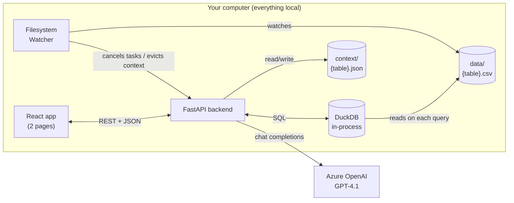
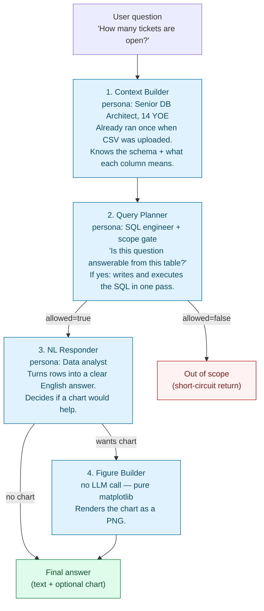
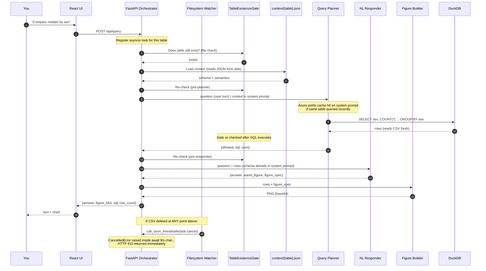
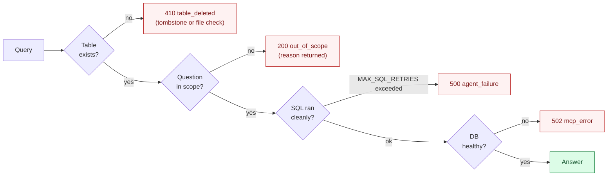
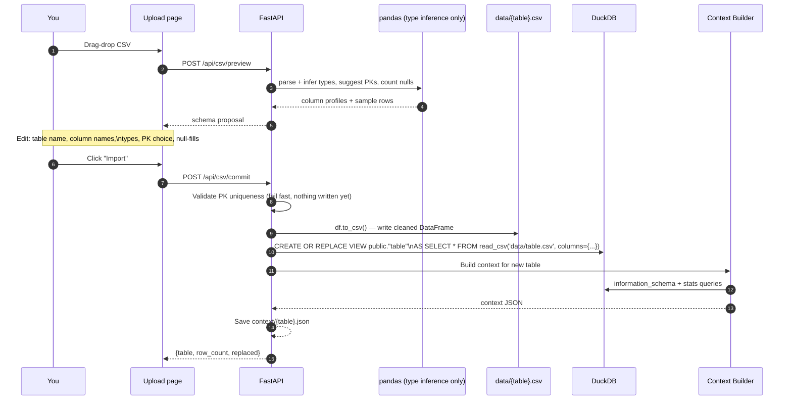

# IGNA Query Agent

> Ask plain-English questions of any CSV you upload. The system figures out the schema, the SQL, and the chart — without ever being told what your data is about.

A desktop-only natural-language interface over a CSV you upload. A 4-agent FastAPI pipeline (Context Builder → Query Planner → NL Responder → optional Figure Builder) queries an in-process **DuckDB** instance so the agents stay data-agnostic: no schema is hard-coded, no row values are ever inlined into prompts beyond a 5-row sample.

```
.
├── backend/    # FastAPI + Azure OpenAI GPT-4.1 + DuckDB (in-process)
├── frontend/   # Vite + React + TS + Tailwind, 2 pages
├── context/    # ./context/{table}.json  — per-table profiles, written by Context Builder
└── data/       # ./data/{table}.csv      — uploaded CSVs (source of truth for all queries)
```

---

## How the pieces fit together



Everything runs on your machine. There are no external databases or spawned processes — the only outbound network call is to Azure OpenAI.

- **DuckDB (in-process)** — an embedded analytical database. CSVs in `data/` are registered as SQL views; every `execute_sql` call reads the file fresh. No separate process, no network, no catalog file on disk.
- **Filesystem Watcher (watchdog)** — monitors `data/` in a background thread. CSV deleted → drops the DuckDB view, evicts context, tombstones the table, and cancels any in-flight LLM tasks immediately.
- **Azure OpenAI (GPT-4.1)** — powers all four agents.

---

## The four agents

> A small team of specialists, each with one job. They pass notes between themselves. If any specialist can't do their job, the line stops — no fake answers.



| # | Agent | Job | LLM call style |
|---|---|---|---|
| 1 | Context Builder | Profile every column: type, cardinality, null rate, semantic meaning | single-shot JSON (stats built in Python; LLM writes semantics only) |
| 2 | Query Planner | Scope gate + SQL writer in one pass; self-corrects on DuckDB errors (up to `MAX_SQL_RETRIES`) | single-shot JSON + Python retry loop |
| 3 | NL Responder | Turn result rows into prose; decide if a chart is warranted | single-shot JSON |
| 4 | Figure Builder | Render matplotlib PNG from chart spec | no LLM — pure Python |

**Why merge scope gate + SQL into one agent?**
The old two-agent design (NL Parser → SQL Agent) made a full LLM round-trip just to classify intent, then a second to write SQL. The Query Planner does both in one call, saving ~500 ms per query with no loss of safety — the scope gate logic is unchanged, just co-located.

**Why split it up at all?**
A single mega-prompt that tries to do everything tends to hallucinate columns, invent SQL syntax, and ignore safety rules. Splitting forces a clean handoff:
- The Query Planner **cannot fabricate rows** — it only writes SQL.
- The NL Responder **cannot write SQL** — it only describes what the Query Planner returned.
- The Figure Builder **makes no decisions** — it renders the spec the NL Responder produced.

---

## How the system "learns" your data — the Context file

When you upload a CSV, the **Context Builder** (Agent 1) runs once and writes `./context/{table_name}.json`. That file is everything the rest of the system "knows" about your table.

```mermaid
sequenceDiagram
    participant U as You
    participant CB as Context Builder (GPT-4.1)
    participant DDB as DuckDB
    participant FS as context/{table}.json

    U->>CB: Build context for table 'support_tickets'
    CB->>DDB: information_schema query (columns + types)
    DDB-->>CB: ticket_id (INTEGER), subject (VARCHAR), ...
    CB->>DDB: one-pass stats CTE (COUNT, DISTINCT, null % per column)
    DDB-->>CB: 42,000 rows; 'resolved_time' is 30% null
    CB->>DDB: SELECT * FROM "support_tickets" LIMIT 8
    DDB-->>CB: sample rows
    Note over CB: Python builds stats; LLM writes<br/>one-sentence semantic per column + PK guess
    CB-->>FS: Write context JSON
    Note over FS: table, row_count,\ncolumns:[{name, type, semantic, ...}],\ndata_quality_flags:[...]
```

**Context is a living document, not a snapshot:**

| Event | What happens to context |
|---|---|
| CSV data edited (same columns) | Context stays valid. DuckDB reads the file fresh on the next query — no action needed. |
| CSV schema changed (columns added / removed / renamed) | Watcher detects header diff → context evicted immediately → rebuilt on next query. |
| CSV deleted | Watcher drops the DuckDB view, evicts context, tombstones the table, and cancels any in-flight LLM tasks. |
| CSV re-uploaded | Tombstone cleared, view re-registered, context rebuilt by Context Builder. |

---

## What happens when you ask a question



---

## Circuit breakers



| Trigger | HTTP | Mechanism |
|---|---|---|
| **Table deleted / missing** | **410** | Event-driven, not polled. Watcher fires on `inotify`/`ReadDirectoryChangesW` within milliseconds. Tombstone checked at every agent boundary. If deletion happens mid-LLM-call, the asyncio task is cancelled via `call_soon_threadsafe` — the HTTP request to Azure is aborted immediately. |
| **Out of scope** | 200 `out_of_scope` | Query Planner sets `allowed=false` — e.g. "what's the weather?" against a tickets table. |
| **DB error** | 502 `mcp_error` | DuckDB raised an exception (malformed SQL, file gone between gate check and execute). |
| **Agent loop exhausted** | 500 `agent_failure` | ReAct iteration cap (default 8) hit without a final answer. |

---

## CSV upload flow



Key choices:

- **No DDL, no INSERT batches.** The CSV is written to `data/` and registered as a DuckDB `VIEW`. A 500,000-row CSV that previously took ~50 s (100 INSERT batches × MCP round-trip) now commits in under 200 ms.
- **DROP + re-register on re-upload.** Re-uploading the same table replaces it entirely — so you can fix a bad PK choice or column type without manual cleanup.
- **PK uniqueness validated up front.** If you pick `email` as the PK but the CSV has duplicates, the import fails before anything is written to disk.
- **Pandas is used only at the upload boundary.** Once the CSV is in `data/`, every read goes through DuckDB. The agents never see a pandas DataFrame.

---

## LLM input caching

The only caching in this system is **Azure OpenAI's transparent prefix caching**.

Each agent receives the table context (schema + semantics) as part of the **system prompt**, not the user message. The system prompt is fixed for the lifetime of a table, so consecutive queries to the same table send an identical leading token sequence to Azure. When Azure's cache is warm (within ~5 minutes of the previous call), the prompt-processing portion of each call is served at reduced latency.

No application-level result cache exists. Every query runs fresh SQL against the CSV, and every LLM call is a new request.

---

## Prerequisites

- Python 3.11+
- Node 18+ (for the Vite/React frontend only — the backend has no Node dependency)
- An Azure OpenAI deployment of **GPT-4.1**

## Setup

```powershell
# Backend
cd backend
python -m venv venv
.\venv\Scripts\Activate.ps1
pip install -e .
copy .env.example .env   # edit: AZURE_OPENAI_ENDPOINT, AZURE_OPENAI_API_KEY, AZURE_OPENAI_DEPLOYMENT

# Frontend
cd ..\frontend
npm install
```

## Run (two terminals)

```powershell
# Terminal 1 — backend
cd backend
.\venv\Scripts\Activate.ps1
uvicorn app.main:app --reload --port 8000

# Terminal 2 — frontend
cd frontend
npm run dev
```

Open http://localhost:5173.

---

## Smoke test (manual)

1. Both servers running; backend logs `opening DuckDB (in-memory)` and `data watcher started`.
2. Go to `/upload`, drop a small CSV (e.g. 200-row Olympics medals sample).
3. Confirm column types, pick a PK (or none), set null-fills, click **Import**.
4. Confirm `data/{table}.csv` exists and `context/{table}.json` has semantic descriptions.
5. Go to `/`, select the table, ask **"Compare medals won by men and women"** → expect prose + bar chart.
6. Ask **"What's the capital of France?"** → expect Out of scope.
7. **While a long query is running**, delete `data/{table}.csv` from Explorer → expect HTTP 410 `table_deleted` with `phase: mid_llm_call` within milliseconds, not after the LLM finishes.
8. Re-upload the same CSV → table is live again, queries resume.
9. Open `data/{table}.csv` in Excel, edit a cell value, save → next query reflects the change (no restart needed).
10. Rename a column header in the CSV and save → backend log shows `schema drift detected → context evicted`; next query rebuilds context automatically.

---

## Configuration (`.env`)

| Var | Default | Purpose |
|---|---|---|
| `AZURE_OPENAI_ENDPOINT` | — | Your Azure OpenAI resource endpoint |
| `AZURE_OPENAI_API_KEY` | — | API key |
| `AZURE_OPENAI_API_VERSION` | `2024-10-21` | API version |
| `AZURE_OPENAI_DEPLOYMENT` | `gpt-4.1` | Deployment name |
| `CONTEXT_DIR` | `../context` | Where per-table JSON profiles live |
| `DATA_DIR` | `../data` | Where uploaded CSVs live (DuckDB views point here) |
| `MAX_REACT_ITERATIONS` | 8 | Hard cap on tool calls per agent run |
| `MAX_SQL_RETRIES` | 2 | Query Planner self-correction budget on DuckDB errors |
| `LOG_LEVEL` | `INFO` | `DEBUG` adds raw LLM payloads + full SQL bodies |

---

## Reading the backend logs

| Logger | What it covers |
|---|---|
| `igna.http` | Every HTTP request — method, path, request-id, status, duration |
| `igna.db` | Every DuckDB call — SQL, elapsed ms, row count, errors |
| `igna.watcher` | Filesystem events — CSV deleted / modified / created, tasks cancelled |
| `igna.gate` | Every TableExistenceGate check (`gate ok` / `gate TRIPPED`) |
| `igna.context` | Save / load / evict of `context/{table}.json` |
| `igna.csv` | CSV preview parse, PK pre-flight, commit progress |
| `igna.query` | Per-phase headers (`phase=pre_planner`, etc.) + query start/end |
| `igna.agent.<name>` | Entry args + exit summary for each agent |
| `igna.llm` | LLM round-trip — latency, token counts, tool calls, final result |

A successful query produces a clean narrative you can read top-to-bottom — `▶` starts an action, `✓` completes it, `✗` fails it, and `════` frames the query lifecycle.

---

## Architecture summary

```
React FE  ─REST─►  FastAPI  ─SQL─►  DuckDB (in-process, reads data/*.csv)
                       │
                       ├─►  Azure OpenAI GPT-4.1 (4 agents)
                       ├─►  context/{table}.json  (per-table schema profiles)
                       └─►  Filesystem Watcher (watchdog, monitors data/)
```

**TableExistenceGate** runs at every agent boundary. If the table disappears mid-query, the next gate trips HTTP 410. If the deletion happens *during* an LLM call, the watcher cancels the asyncio task immediately via `call_soon_threadsafe` — no waiting for Azure to respond.

### Circuit breakers

| Code | Name | When |
|---|---|---|
| **410** | `table_deleted` | Table missing at any agent boundary, or CSV deleted mid-LLM-call (task cancelled within milliseconds). |
| 200 | `out_of_scope` | Query Planner set `allowed=false`. |
| 502 | `mcp_error` | DuckDB raised an exception. |
| 500 | `agent_failure` | ReAct iteration cap exceeded. |

---

## What is intentionally NOT in scope

- No login / auth.
- No multi-table joins — one CSV, one table, one context.
- No data cleaning beyond null-fills (no row drops, no type-recast).
- No deployment story — desktop only.
- No conversation memory — each question is stateless; the LLM does not remember prior questions in the session.
