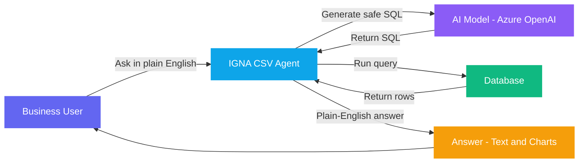
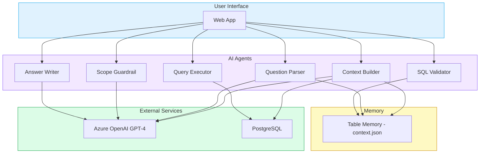
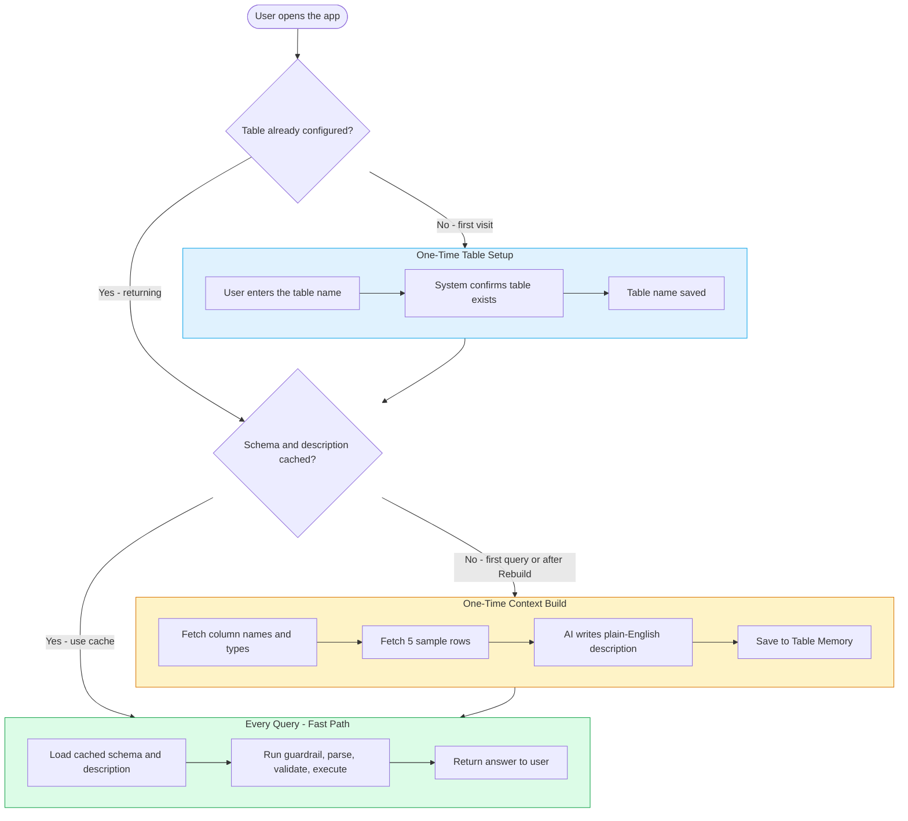
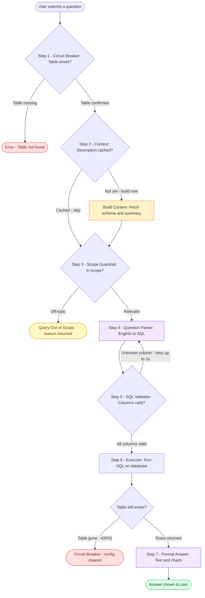
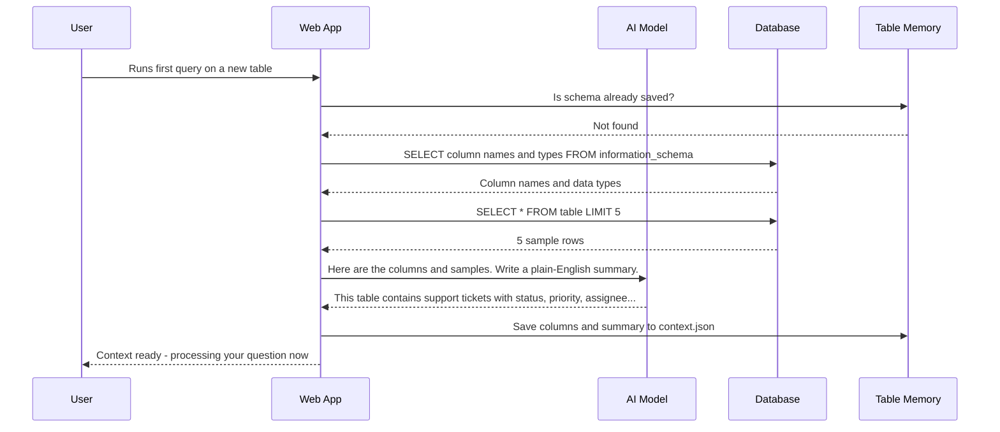
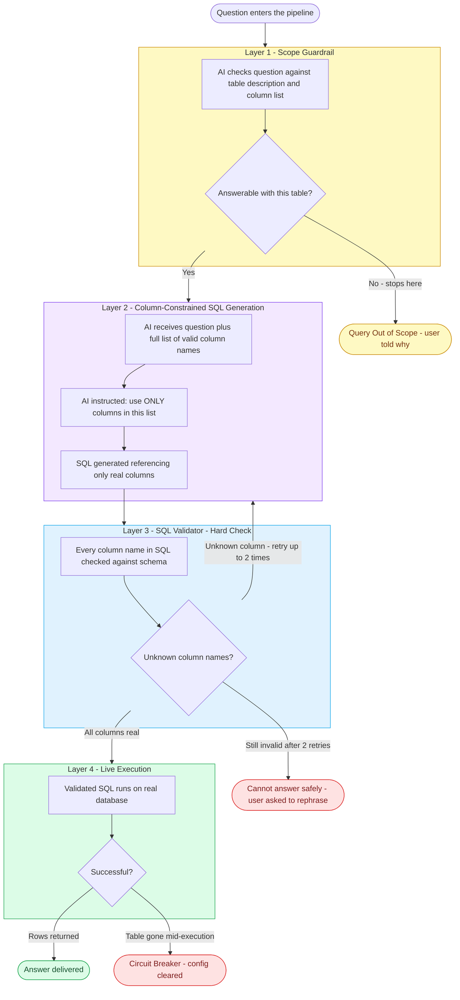
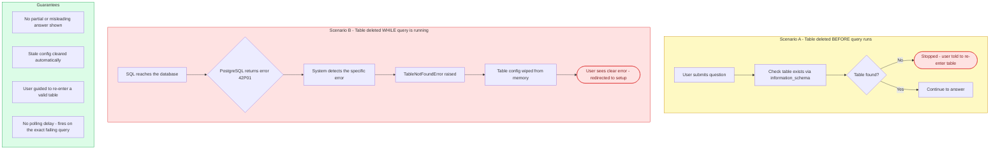
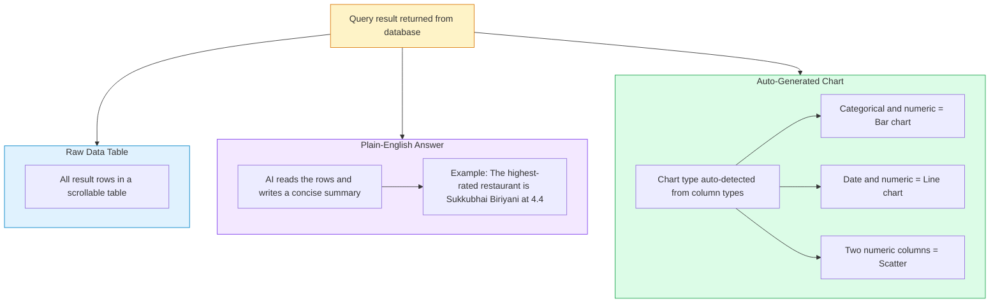
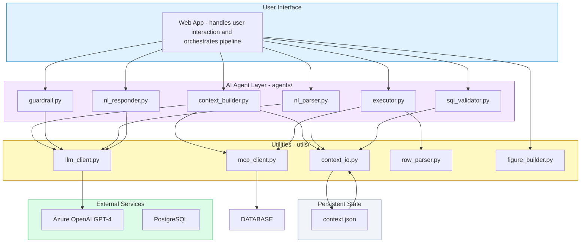

# CSV Agent — How It Works
### Architecture & Flow Diagrams
> Prepared for Executive Presentation · Techno-Functional Audience

---

## Contents

1. [What Is IGNA CSV Agent?](#1-what-is-igna-csv-agent)
2. [System Components at a Glance](#2-system-components-at-a-glance)
3. [First-Time Setup vs Every-Day Use](#3-first-time-setup-vs-every-day-use)
4. [Full Query Pipeline - Step by Step](#4-full-query-pipeline---step-by-step)
5. [How the System Learns Your Table Once](#5-how-the-system-learns-your-table-once)
6. [Four Layers of Protection Against Bad Answers](#6-four-layers-of-protection-against-bad-answers)
7. [Circuit Breaker - What Happens if the Table Is Deleted](#7-circuit-breaker---what-happens-if-the-table-is-deleted)
8. [How Your Answer Is Shown](#8-how-your-answer-is-shown)
9. [Component Map - What Each Part Does](#9-component-map---what-each-part-does)

---

## 1. What Is IGNA CSV Agent?

IGNA CSV Agent lets a business user ask questions about their data **in plain English** - no SQL knowledge needed. It connects to a database table, understands the structure automatically, and returns answers as readable text, charts, or both.

---

## 2. System Components at a Glance

Six specialised modules each own a single responsibility.

---

## 3. First-Time Setup vs Every-Day Use

The system does heavy learning **only once per table**. Every subsequent query skips straight to answering.

---

## 4. Full Query Pipeline - Step by Step

Every question travels through five sequential checkpoints. Any checkpoint can stop the pipeline early.

---

## 5. How the System Learns Your Table Once

The Context Build happens once, saves everything, and is reused on every query until you ask for a rebuild.

---

## 6. Four Layers of Protection Against Bad Answers

Four independent checkpoints prevent hallucinated column names and off-topic answers.

---

## 7. Circuit Breaker - What Happens if the Table Is Deleted

If a table is deleted at any point, the system detects it instantly and stops cleanly.

---

## 8. How Your Answer Is Shown

Every query returns three things: raw data, a plain-English explanation, and auto-generated charts.

---

## 9. Component Map - What Each Part Does

Every file has exactly one responsibility.

---

## Summary - Key Design Decisions

| Decision | Why |
|---|---|
| **Context built once, cached forever** | Avoids repeated schema lookups on every query. Rebuild is user-controlled. |
| **Guardrail checks column list, not just topic** | Stops questions about data that does not exist before any SQL is generated. |
| **SQL validator is a hard rule-based check** | Not probabilistic - every column name is checked against a known list. AI cannot bypass it. |
| **TableNotFoundError propagates uncaught** | The pipeline crashes instantly and cleanly on mid-query table deletion. No partial answers. |
| **All DB access via MCP connector** | Single entry point for all database calls. Error detection (42P01) is centralised in one place. |

---

_IGNA CSV Agent - Internal Architecture Documentation_
